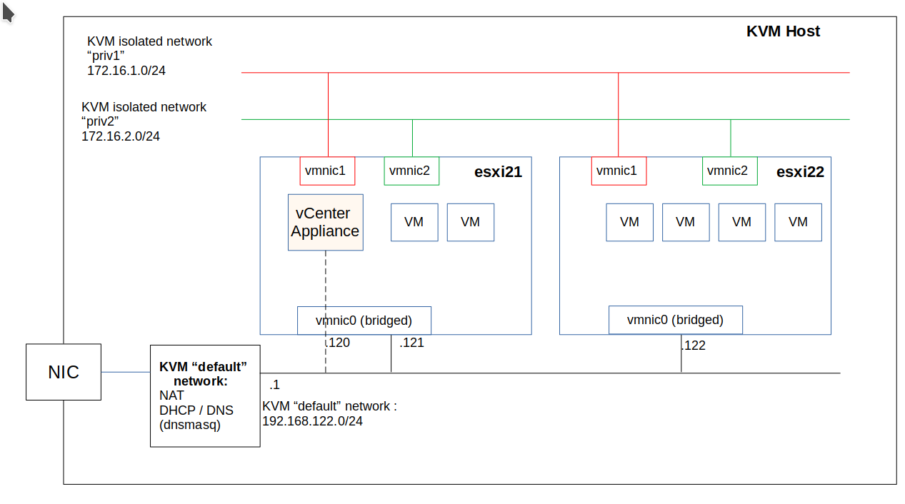

# vmware-vsphere7-on-kvm-lab
Home lab nested installation of vSphere 7 on KVM

This document describes the deployment of a basic vSphere  7  lab hosted in a nested  Linux KVM environment.

The diagram below summarizes the deployment

