# vSphere 7 - Nested Lab on Linux / KVM


## Introduction and Motivation

This document describes the deployment of a basic vSphere  7  lab hosted in a nested  Linux KVM environment.

The diagram below summarizes the deployment

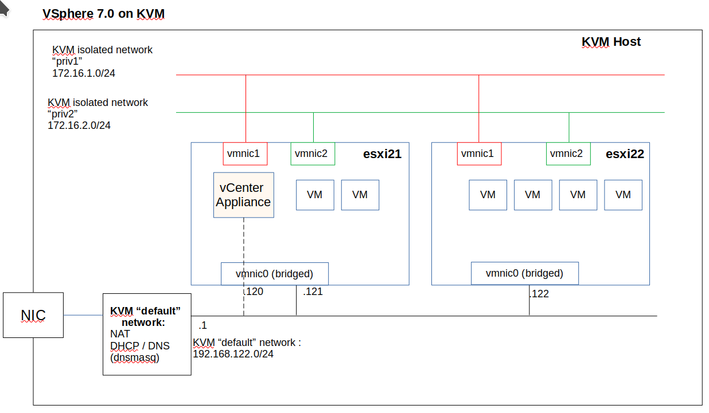

**Motivation**:  Deploying a vSphere nested environment in KVM is admittedly not very practical.   Most people would recommend using ESXi as the base hypervisor for these experiments.   

In my case, I do not wish to have a dedicated home lab environment with servers, storage, etc.   I use instead  a 15" laptop running Kubuntu  that doubles as  second home computer and media server.  I do most of my cloud and virtualization work and testing either in cloud providers or in this laptop using KVM.

**Disclaimer**: The usual caveats apply:  This is a lab built on non-supported virtual hardware and should not be deployed or tested in any production environment.   You should backup  your systems before deploying this and similar labs, etc. 

## References 

This document is partially based on the excellent blog entries by Fabian Lee on [ESXi on KVM](https://fabianlee.org/2018/09/19/kvm-deploying-a-nested-version-of-vmware-esxi-6-7-inside-kvm/),  and [vCenter on KVM](https://fabianlee.org/2018/11/06/kvm-deploy-the-vmware-vcenter-appliance-using-the-cli-installer/) for vSphere 6.7

The main differences  and additions to those sources from this experiment :

- vSphere 7.0 instead of vSphere 6.7 - this implies the following modifications to the deployment 
  - Requires modifying the NIC  to use "vmxnet3" (e1000 no longer supported in KVM 7)
  - Requires deploying two disks per ESXi  VM - one for booting ESXi  and one for VM datastore.  The ESXi VM can boot with a single disk but when deploying VMs inside ESXi it does not allow using that disk to define a datastore.
    - there may be other workarounds to this topic...
- vCenter Installation
  - Mount appliance iso and run installer in KVM host  (instead of dedicated VM)
  - Use GUI instead of cli installer for vCenter Appliance
- vCPU - I used "--cpu host" instead of "--cpu host-model-only".   Without this change,  VMs inside ESXi hosts refused to start.
- Networking:
  - Use additional KVM "isolated networks" (additional NICs in the ESXi hosts) in addition to the KVM default network 
  - (TODO) explore dedicated network for VMotion and Management (heartbeat)
- Storage :  (TODO) explore FreeNAS for iSCSI and/or NFS storage in addition to local disks.
- Others:  Use VMware Photon VMs (OVF) for testing instead of an ubuntu net ISO image.

### Initial Experience

- I tried the installation process described below with both vSphere 6.7 and vSphere 7.0.  The experience with vSphere 7.0 was more complicated and slower, particularly with the installation of vCenter.  I am still deciding whether for the purposes of this lab (learning VMware vSphere and eventually NSX) I should stick with vSphere 6.7 for the time being.

## POC / Lab Environment

### Host - Kubuntu

Hypervisor / KVM Host:  15" laptop ([Slimbook PRO Base 15 i7](https://slimbook.es/en/)) with 8 CPUs, 32GB RAM and 2 x 1TB SSD hard disks (one of them NVMe) 

OS - Kubuntu 20.04 

Below is a subset of the /proc/cpuinfo for the first cpu

```bash
$ cat /proc/cpuinfo
processor       : 0
vendor_id       : GenuineIntel
cpu family      : 6
model           : 142
model name      : Intel(R) Core(TM) i7-10510U CPU @ 1.80GHz
stepping        : 12
microcode       : 0xd6
cpu MHz         : 2245.567
cache size      : 8192 KB
physical id     : 0
siblings        : 8
core id         : 0
cpu cores       : 4
apicid          : 0
initial apicid  : 0
fpu             : yes
fpu_exception   : yes
cpuid level     : 22
wp              : yes
flags           : fpu vme de pse tsc msr pae mce cx8 apic sep mtrr pge mca cmov pat pse36 clflush dts acpi mmx fxsr sse sse2 ss ht tm pbe syscall nx pdpe1gb rdtscp lm constant_tsc art arch_perfmon pebs bts rep_good nopl xtopology nonstop_tsc cpuid aperfmperf pni pclmulqdq dtes64 monitor ds_cpl vmx est tm2 ssse3 sdbg fma cx16 xtpr pdcm pcid sse4_1 sse4_2 x2apic movbe popcnt tsc_deadline_timer aes xsave avx f16c rdrand lahf_lm abm 3dnowprefetch cpuid_fault epb invpcid_single ssbd ibrs ibpb stibp ibrs_enhanced tpr_shadow vnmi flexpriority ept vpid ept_ad fsgsbase tsc_adjust bmi1 avx2 smep bmi2 erms invpcid mpx rdseed adx smap clflushopt intel_pt xsaveopt xsavec xgetbv1 xsaves dtherm ida arat pln pts hwp hwp_notify hwp_act_window hwp_epp md_clear flush_l1d arch_capabilities
bugs            : spectre_v1 spectre_v2 spec_store_bypass swapgs itlb_multihit srbds
bogomips        : 4599.93
clflush size    : 64
cache_alignment : 64
address sizes   : 39 bits physical, 48 bits virtual
power management:
```

Here is some unsolicited advertising plugin for the Slimbook brand of linux-oriented laptops from the famed [dedoimedo website](https://www.dedoimedo.com/computers/slimbook-pro2-here.html)

## Hypervisor - KVM

### KVM Installation and verification

 - The following [companion article](https://fabianlee.org/2018/08/27/kvm-bare-metal-virtualization-on-ubuntu-with-kvm/) to the vSphere-on-KVM references mentioned above provides a good introduction to the installation of KVM.
 - Versions used for Kubuntu, KVM and virsh/libvirtdThe installation process

```
$ cat /etc/os-release 
NAME="Ubuntu"
VERSION="20.04.1 LTS (Focal Fossa)"
ID=ubuntu
ID_LIKE=debian
PRETTY_NAME="Ubuntu 20.04.1 LTS"
VERSION_ID="20.04"

$ uname -a
Linux rpslim 5.4.0-42-generic #46-Ubuntu SMP Fri Jul 10 00:24:02 UTC 2020 x86_64 x86_64 x86_64 GNU/Linux

$ kvm --version
QEMU emulator version 4.2.0 (Debian 1:4.2-3ubuntu6.3)
Copyright (c) 2003-2019 Fabrice Bellard and the QEMU Project developers

$ virsh version
Compiled against library: libvirt 6.0.0
Using library: libvirt 6.0.0
Using API: QEMU 6.0.0
Running hypervisor: QEMU 4.2.0

```


### KVM networking

 - All VMs (ESXi hosts) have their main NIC linked to the  *default*  libivrt network,  associated to the usual subnet 192.168.122.0/24 
 - DNS and DHCP (if using dynamic addresses) are handled by the dnsmasq instance associated with the *default* network of KVM.    We do not modify directly the dnsmasq configuration files.  Instead the configuration is done through libvirt ,  either using "virsh" commands or updating the *default* network XML configuration file. 

#### IP assignment for ESXi and vCenter VMs / DHCP vs Static

- The ESXi and vCenter VMs will have static addresses in their main interfaces, that are associated to the  KVM default network
- Looking at the DHCP  section in the  *default* network configuration XML file (see DNS section, pasted below for convenience) we see that the range for dynamic addresses is from 192.168.122.10 - .99.  Thus we chose the static addresses for the ESXi and vCenter addresses outside of this range.

```
  <ip address='192.168.122.1' netmask='255.255.255.0'>
    <dhcp>
      <range start='192.168.122.10' end='192.168.122.99'/>
    </dhcp>
  </ip>
```

  

#### DNS for VMs

- It is important for the ESXi and vCenter installation that all hosts have DNS entries.
- The VMs will have configured as DNS server : 192.168.122.1.  This is the dnsmasq DNS/DHCP server associated with the default network.
- This server can be configured using the command ```virsh net-edit default```  that starts an editor to modify the default network XML configuration file.   Add the lines between ```<dns>``` and ```</dns>```.  In this example we have added 3 entries,  one for each ESXi host (esxi21 and esxi22) and one for the vCenter VM running in esxi21.  

```xml
<network>
  <name>default</name>
  <uuid>cedc08b7-e83d-48ae-9806-3b4de0481c7f</uuid>
  <forward mode='nat'/>
  <bridge name='virbr0' stp='on' delay='0'/>
  <mac address='52:54:00:62:d4:02'/>
  <domain name='home.lab'/>
  <dns>
    <host ip='192.168.122.121'>
      <hostname>esxi21.home.lab</hostname>
    </host>
    <host ip='192.168.122.122'>
      <hostname>esxi22.home.lab</hostname>
    </host>
    <host ip='192.168.122.120'>
      <hostname>vcenter.home.lab</hostname>
    </host>
  </dns>
  <ip address='192.168.122.1' netmask='255.255.255.0'>
    <dhcp>
      <range start='192.168.122.10' end='192.168.122.99'/>
    </dhcp>
  </ip>
</network>

```

- After modifying this file,  restart the *default* network with the command 

  ```bash
  $ virsh net-destroy default && virsh net-start default
  ```

  If connectivity to VMs is lost after restarting the *default* network, an option is to restart the libvirtd service

  ```
  $ sudo systemctl restart libvirtd.service
  ```

  NOTE: according to the libvirtd man entry  it is safe to restart libvirtd for running VMs with a persistent configuration:

  *Restarting libvirtd does not impact running guests.  Guests continue to operate and will be picked up automatically if their XML configuration has been defined.  Any guests whose XML configuration has not been defined will be lost from the configuration.*

  ("defined" above refers to the *virsh define* (persistent) as opposed to the *virsh create* (non-persistent) command)

-  An alternative to editing the network definition XML file is to use the 'virsh net-update' command, issuing one command per host:

   ``` 
   $ virsh net-update default add dns-host  "<host ip='192.168.122.120'><hostname>vcenter.home.lab</hostname></host>" --config --live
   
   $ virsh net-update default add dns-host  "<host ip='192.168.122.121'><hostname>esxi21.home.lab</hostname></host>" --config --live
   
   $ virsh net-update default add dns-host  "<host ip='192.168.122.122'><hostname>esxi22.home.lab</hostname></host>" --config --live
   
   ```

   

#### DNS / Name resolution at host Level

- **NOTE** - this  hypervisor does not use a host-level instance of dnsmasq or other DNS server.   Per ubuntu default installations, at host level it uses the recent (and somewhat controversial)  *systemctl resolved* resolver.  

- In practice we chose to add the same hosts to the host-level /etc/hosts file to make sure they are visible from the host (e.g. to use vSphere client, etc...)

  ```
  $ cat /etc/hosts
  (...)
  # vSphere 7.0 lab
  192.168.122.120 vcenter vcenter.home.lab
  192.168.122.121 esxi21 esxi21.home.lab
  192.168.122.122 esxi22 esxi22.home.lab
  # vSphere 6.7 lab
  192.168.122.110 vcenter0 vcenter0.home.lab
  192.168.122.111 esxi11 esxi21.home.lab
  192.168.122.112 esxi12 esxi12.home.lab
  (...)
  ```

- Some people choose to disable systemd-resolved and use instead a host-level instance of dnsmasq.  In this case it is needed to make it coexist with the KVM network level instance of dnsmask.   See for example https://www.ctrl.blog/entry/resolvconf-tutorial.html

  

#### Connectivity to Outside world

- All VMs have as default route  192.168.122.1 in the *default* KVM network.
- The *default* network is configured by default to use NAT to the outside world.

#### NTP

- We configure the VMs to access directly NTP servers (pool.ntp.org) in Internet.

#### Creation of an isolated network in KVM

 - In addition, we define in KVM / Libvirt two additional host-only networks that will be used for additional network interfaces in the ESXi  Hosts (VMs of KVM).   Some functions that could be tested over these networks are 
    - for storage (NFS datastores and iSCSI datastores with freeNAS - if and/when implemented)
    - vMotion and Management (heartbeat)
    - These networks are defined in KVM as "isolated" and do not have visibility outside of the KVM hypervisor.  
    - The next section summarizes the creation of the first network ('priv1')

- Install bridge utilities to view and manage bridges in the KVM Host (brctl)
```bash
sudo apt-get install bridge-utils
```

Using virsh  (libvirt) create private network priv1.  This will automatically create a bridge in the KVM host for this specific network.

Create XML file with the network definition.  The example below is based on the [libvirt documentation](https://libvirt.org/formatnetwork.html).  The XML file  (say ```private-net1.xml```) can be created in any directory.  This file can be discarded after defining the network with virsh,  since the network configuration and status will thereafter be managed by libvirt.

```
<network>
  <name>priv1</name>
  <bridge name='virbr1'/>
  <ip address='172.16.1.1' netmask='255.255.255.0'>
    <dhcp>
      <range start='172.16.1.2' end='172.16.1.100'/>
    </dhcp>
  </ip>
</network>
```

Define the network with virsh.  Note that we use the ```virsh net-define``` to generate a persistent network.   The ```virsh net-create``` command would generate a non-persistent network

```bash
$ virsh net-define ./net-priv1.xml
Network priv3 defined from ./net-priv1.xml
```


We can now see the actual definition of the network as managed by libvirt.  Note that libvirt has added information --such as UUID, MAC address, etc... -- to the network definition.  Some of this information could have been also included in the original XML file.

```
$ virsh net-dumpxml priv1
<network connections='3'>
  <name>priv1</name>
  <uuid>3549f972-9a58-410b-a5bb-b769bd4d58b3</uuid>
  <bridge name='virbr1' stp='on' delay='0'/>
  <mac address='52:54:00:8d:34:76'/>
  <ip address='172.16.1.1' netmask='255.255.255.0'>
    <dhcp>
      <range start='172.16.1.2' end='172.16.1.100'/>
    </dhcp>
  </ip>
</network>
```

The command has also created the virbr1 bridge and an IP interface (virbr1-nic) associated with it.  Note that the virbr0 and virbr0-nic are created automatically when installing KVM on the host.

```
$ brctl show
bridge name     bridge id               STP enabled     interfaces
virbr0          8000.52540062d402       yes             virbr0-nic
virbr1          8000.525400539d18       yes             virbr1-nic
```

This virtual network can also be seen using the Virtual Machine Manger (virt-mgr) GUI tool  (select any VM, and the "Edit Connection Menu option")


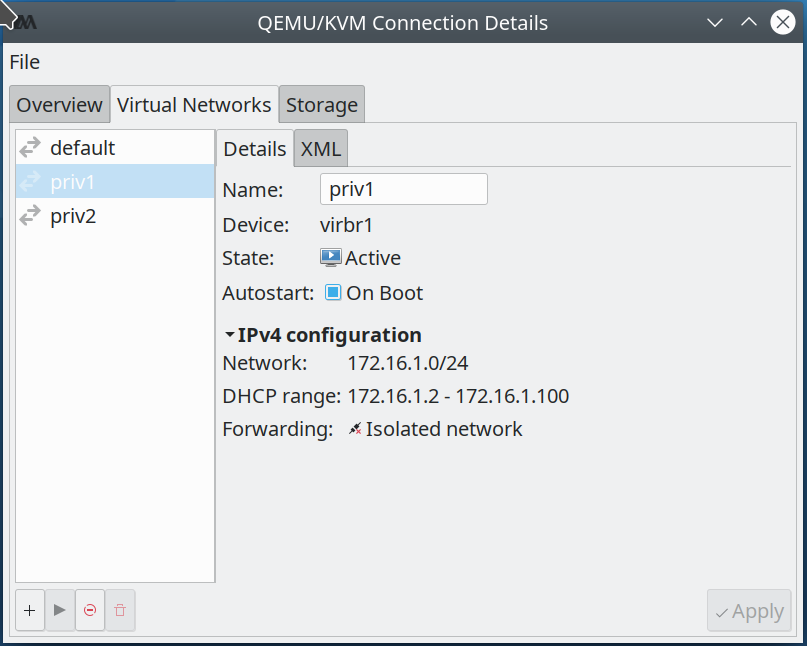


## ESXi installation -  first ESXi node to host vCenter 

### Download vSphere 7.0 installation ISOs

- Register for My VWare and download evaluation at: https://my.vmware.com/group/vmware/evalcenter?p=vsphere-eval-7

- Downloaded files

  - VMware vSphere Hypervisor (ESXi ISO) image

    - Description: *Boot your server with this image in order to install or upgrade to ESXi (ESXi requires 64-bit capable servers). This ESXi image includes VMware Tools.*
    - File: VMware-VMvisor-Installer-7.0b-16324942.x86_64.iso   (325M)

  - VMware vCenter Server Appliance

    - Description: *vCenter Server Appliance ISO. It includes the UI and CLI installer for install\,upgrade\,migration for VMware vCenter Server Appliance\, VMware Platform Services Controller\, VMware vSphere Update Manager and Update Manager Download Service (UMDS).*
    - File:  ~~VMware-VCSA-all-7.0.0-16386292.iso~~  VMware-VCSA-all-7.0.0-16620007.iso (6.7GB)
    - NOTE: this version 7.0.0-16386292 could not complete the vCenter installation.  A few days later I downloaded a more recent version (7.0.0-16620007) that managed to complete the installation.
  
- Verify Checksums:
  
    ```
    $ shasum ./VMware-VMvisor-Installer-7.0b-16324942.x86_64.iso 
    9eeff60e4257d763f49d9b39e1dbaee4fe22acbd  ./VMware-VMvisor-Installer-7.0b-16324942.x86_64.iso
    $ shasum ./VMware-VCSA-all-7.0.0-16386292.iso 
    c5c8beefc3237836830cfaa7580d901dcef081bb  ./VMware-VCSA-all-7.0.0-16386292.iso
  ```
  
    

### ESXi VM parameters:

- VM Name : esxi21
- RAM : initially allocate 20G to allow for the vCenter Installation (requires 19G to start process)
- 2 disks 
  - 10G disk to host ESXi and (TODO: finetune size)
  - 30G disk for datastore(s). 
  - Specifying two disks attempts to overcome the issue seen in vSphere 7.0 and not in 6.7: specifying a single disk results in no datastore post-installation.  Single disk is visible in the ESXi web GUI but cannot be used to define datastores  (or at least I could not figure out how to do it)
- CD ROM : pointing to vsphere 7.0 ESXI installer iso.
- NICs -  type *vmxnet3*  (*e1000* not supported in 7.0) :  one in KVM "default" network, one in "priv1" isolated network, one in "priv2" isolated network
- CPU :  use "--cpu host"


### Launch ESXi VM installation command

*virt-install* command:

We use here a modified version of Fabian Lee's command to account for the VM parameters discussed above (note you need to modify the path to the .iso installer in the --cdrom )

```bash
$ virt-install --virt-type=kvm --name=esxi21 --ram 17000 --vcpus=4 --virt-type=kvm --hvm --cdrom /path/to/esxi/installer/VMware-VMvisor-Installer-7.0b-16324942.x86_64.iso --network network:default,model=vmxnet3 --network network:priv1,model=vmxnet3 --network network:priv2,model=vmxnet3 --graphics vnc --video qxl --disk pool=default,size=10,sparse=true,bus=ide,format=qcow2 --disk pool=default,size=30,sparse=true,bus=ide,format=qcow2 --boot cdrom,hd --noautoconsole --force --cpu host
```

If the command succeeds, KVM will launch the *esxi21* VM and it will boot from the installer ISO.

The installation progress can be followed in the console opening the VM in *virt-mgr* or using the *virt-viewer* utility

```
$ virt-viewer esxi21 &
```

### ESXi Installation Progress

Below some screenshots of the install project.  In one of the steps, not shown,  we select a password for the root user of the hypervisor.

Loading Installer:

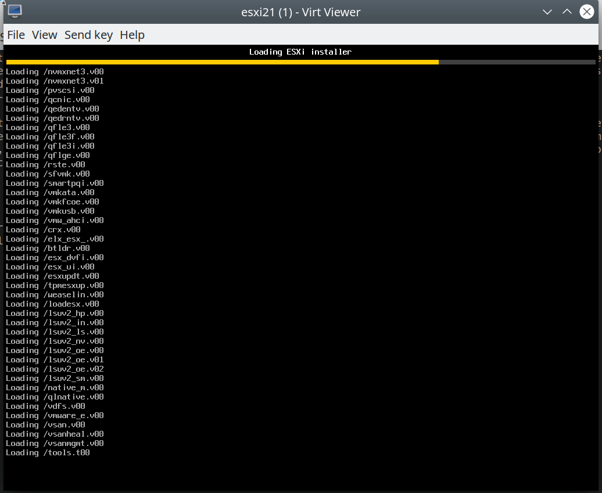

Welcome Screen

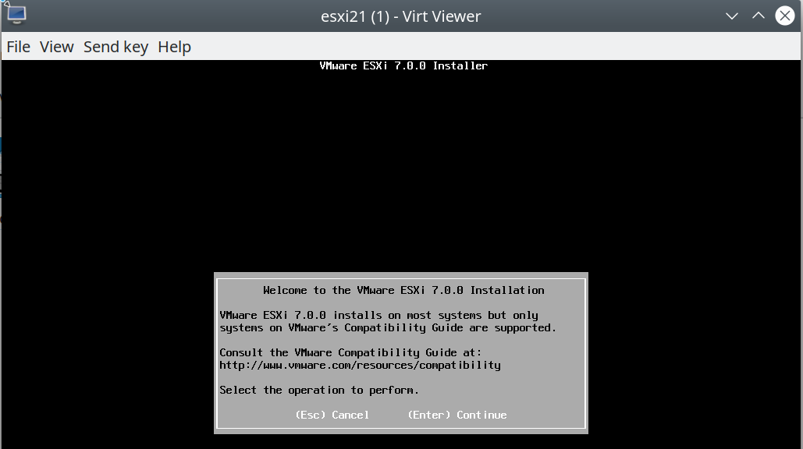


Disk Selection - select the 10GB Disk for ESXi OS installation

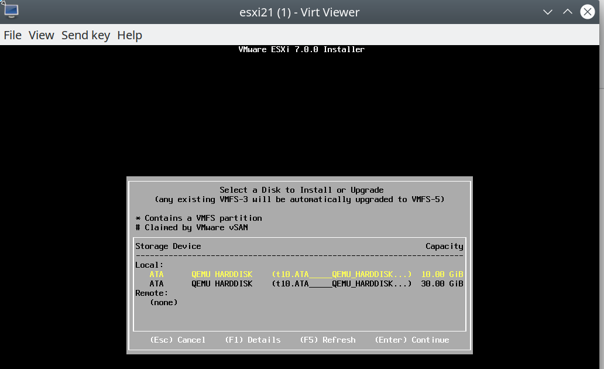


After a confirmation screen, and a few minutes installation, the installation is complete

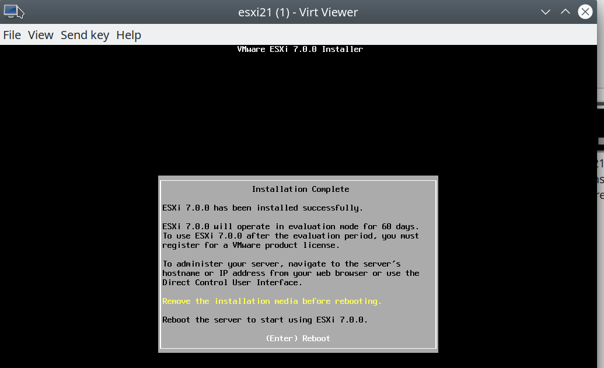

Pressing enter shuts down the *esxi21* VM.   In our case there was no reboot. the VM had to be restarted manually using virsh

```$ virsh start esxi21```

Running again virt-viewer we access the console

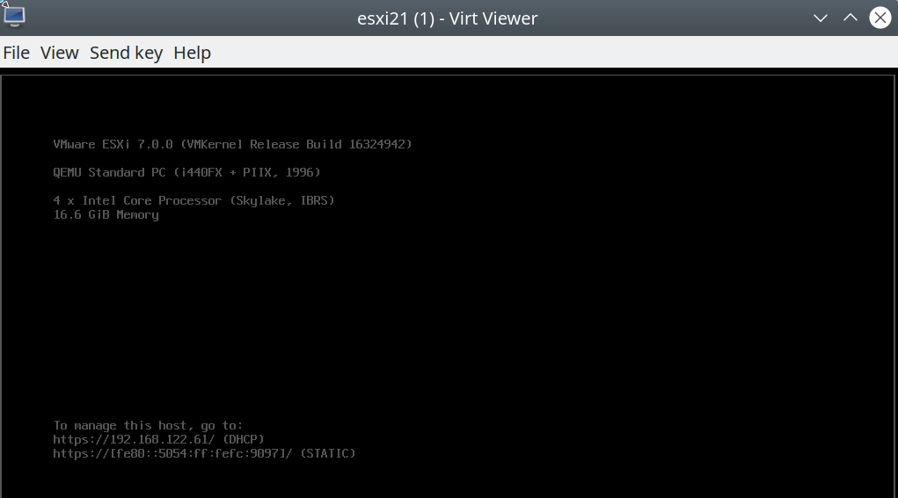

We verify that the host is also accessible via web interface (note that the address shown is DHCP assigned and will be changed in subsequent steps to a fixed address).   Username : "root" with the password selected during the installation process.

### ESXi Host Configuration and Testing

Perform basic configuration and testing of the ESXi Host:

- Network configuration (management):
  - Static IP address configuration :  
    - IP : 192.168.122.121/24
    - Default gateway : 192.168.122.1
    - DNS server : 192.168.122.1   (dnsmaq instance specific to the KVM default network)
  - Host Name : esxi21
  - DNS suffix (appended to DNS queries) : home.lab
- Enable ssh server and esxcli   
- Create a Datastore (will use GUI) - unlike in the case of vSphere 6.7,  a datastore is not automatically created based on the boot disk.
- Launch a test VM (will use GUI), in this case a VMware Photon  (VMware's linux)

#### Network, DNS, hostname and domain name configuration

In the welcome console screen, press F2 to login  (root)

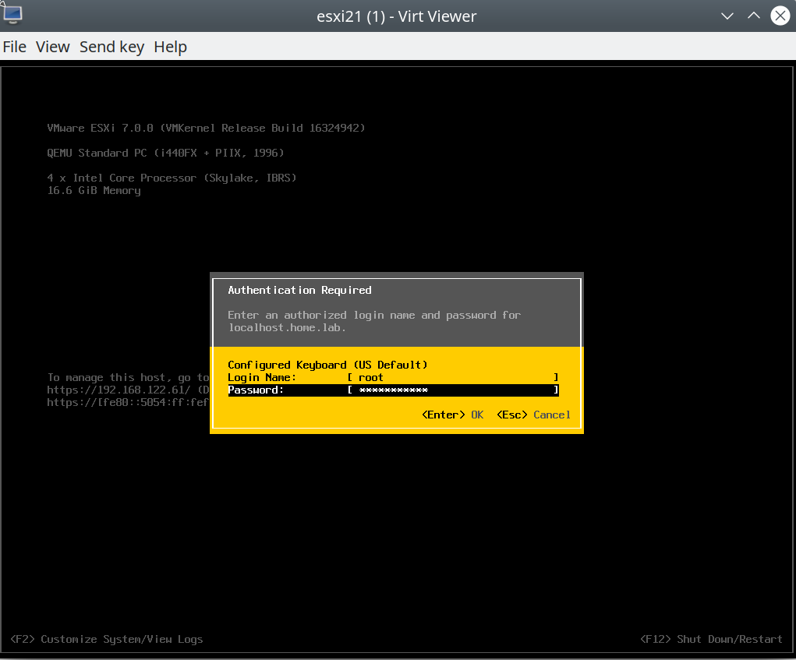

Once logged in, select **Configure Management Network  /  IPv4 Configuration**

- Static IP assignment 
- IP : 192.168.122.121/24  with default network .1  (KVM hypervisor)

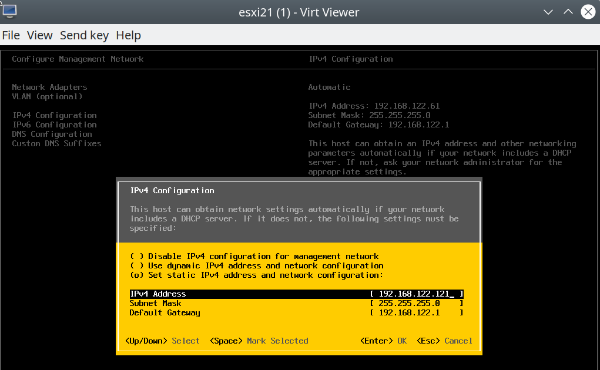

**Configure Management Network  /  DNS Configuration**

- Use statically defined DNS server and configuration
  - DNS Server : 192.168.122.1  (KVM hypervisor in *default* network)
  - hostname :  esxi21

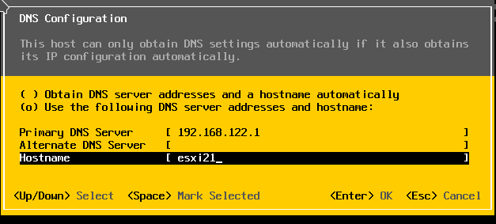


**Configure Management Network  /  DNS Suffixes**

- Select suffix(es) that will be appended short names when performing dns queries (e.g. a query for esxi13 will result in esxi13.home.lab) - in this case we are using "home.lab"

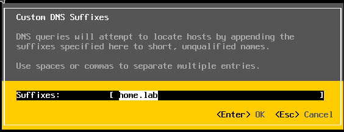

Confirm changes and Restart Management Network to activate new parameters

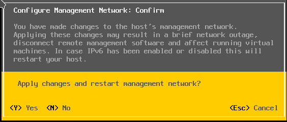

Verify that we can ping the new esxi21 VM from the KVM Hypervisor,  both using the IP address (192.168.122.121) and the host name  (esxi21 or esxi21.home.lab)

Verify connectivity to the host using the GUI interface.  Connect with a browser to http://192.168.122.112 or http://esxi12 .  Ignore warnings about certificates for the time being.

#### Create a Datastore

As mentioned above, when installing an ESXi 7.0 host with a second disk, it does not seem to allow using space the boot disk as a datastore  (I have not researched, this issue in detail -- simply found a workaround)  

- TODO - document/understand behavior

To create VMs we need to create a datastore, based on the 2nd disk assigned by KVM/QEMU to this ESXi hypervisor.

Connecting to esxi21 over using the Web GUI we observe that there are no datastores defined

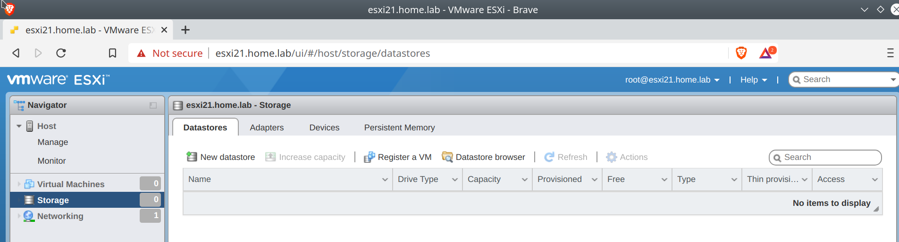

We create a new datastore using the second disk.  This datastore will be used for VMs including the vCenter appliance.

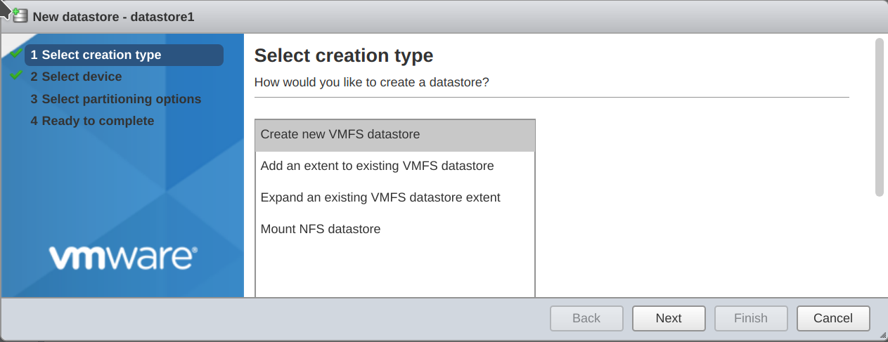

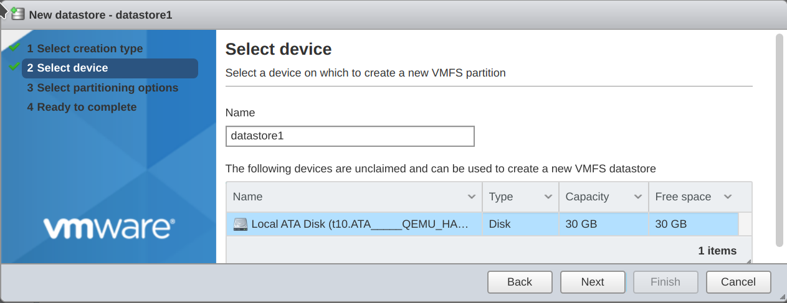

#### 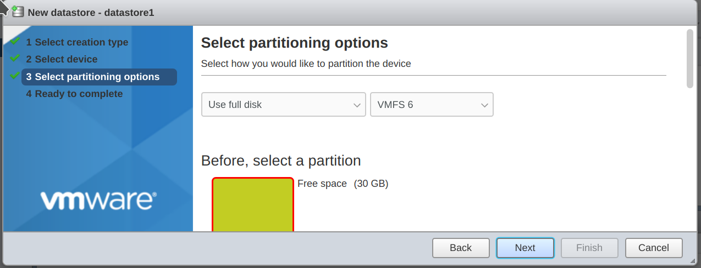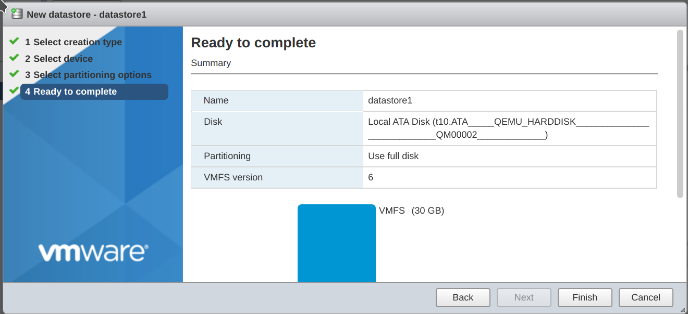

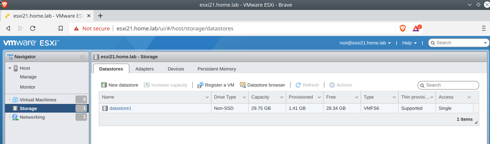


NOTE: you may need a larger datastore - I eventually ended using a 80GB datastore built with 2 40GB virtual disks in the esxi21 hypervisor.

## Installing vCenter  in esxi21 


### Prepare ESXi hypervisor to host the vCenter Appliance


vCenter must be installed in an ESXi hypervisor.  In our case we will install it in one of the ESXi hypervisors (esxi21) running as VM in the KVM host.

The vCenter VM  requires 19G RAM available for installation (compared with 16G for vSphere 6.7).  If VM RAM needs to be adjusted, shut down the esxi21  host, and adjust the memory in the VM definition using virt-manager to 20GB  (or ```virsh edit esxi21```). Then restart the esxi21 VM

### Mount  and launch vCenter installer 

Version to be installed : VMware-VCSA-all-7.0.0-16620007.iso.

This iso, when mounted, provides access to Windows and Linux CLI and GUI installers.   In this case we use the linux GUI installer.  In this case we will run the installer in the KVM host, that has IP connectivity to the esxi1 hypervisor where vCenter will be installed.

- Mount the installation iso as a local directory in the KVM host:

  ```bash
  # Create mount point
  $ sudo mkdir /mnt/vcenter
  # Mount iso to mount point
  $ sudo mount -o loop  /path/to/iso/VMware-VCSA-all-7.0.0-16620007.iso /mnt/vcenter/
  mount: /mnt/vcenter: WARNING: device write-protected, mounted read-only.
  
  # verify contents - UI installer for linux
  $ ls -lh /mnt/vcenter/vcsa-ui-installer/lin64/
  total 141M
  (...)
  -r-xr-xr-x 1 root root  110M May  4 10:51 installer
  (...)
  -r-xr-xr-x 1 root root     6 May  4 10:51 version
  
  ```

  

- Execute installer  located at  <iso-mountpoint>/vcsa-ui-installer/lin64/installer

  ```$ /mnt/vcenter/vcsa-ui-installer/lin64/installer```

- Starting screen:

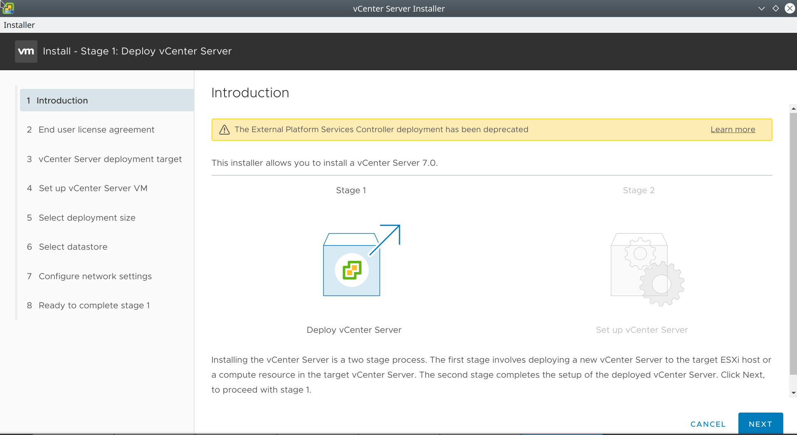

- Accept license and usage terms
- Data and credentials for target ESXi host for installation of vCenter VM (esxi21)

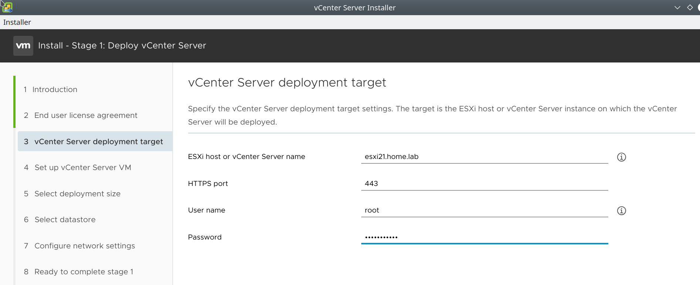

- Certificate warning - OK

  (complains that esxi21 was in maintenance mode - correct and retry - OK)

- vCenter VM - name and root password for server   

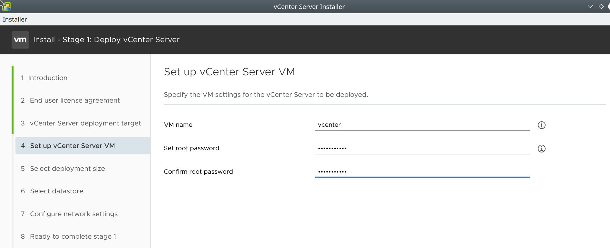

(initial installation attemp failed here with an error about opening the .ova file  -- fixed downloading a slightly newer iso from My VMware:  7.0.0-16620007 )

Select deployment size

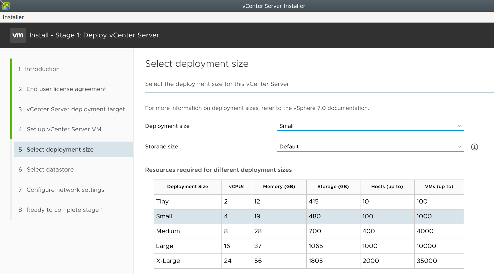

Select datastore - this is the manually created datastore associated with the second disk - thin disk mode

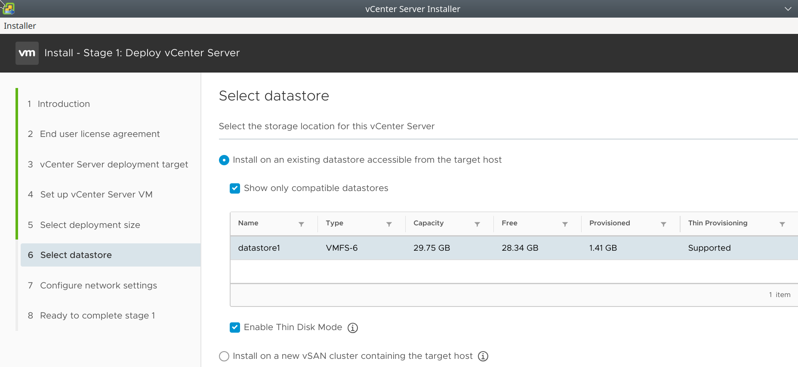

Network Settings


Ready to complete

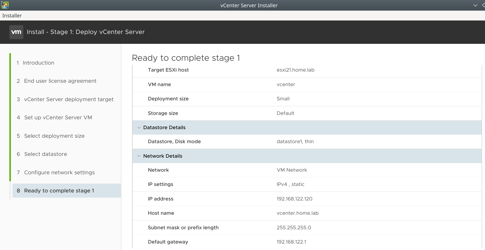

Stage 1 of the installation starts -  progress bar

End of Stage 1

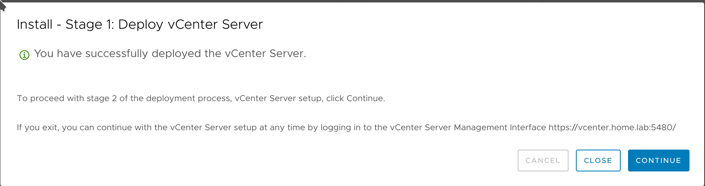

Installation stalled several times at around 90%.  In one occasion I saw in the ESXi web interface complain about vmdk11 being full.   I added a very large datastore composed of 2 80G disks to this ESXi host.   Eventually stage 1 completed after about 2 hours.

Start Stage 2

vCenter Server config - NTP and SSH

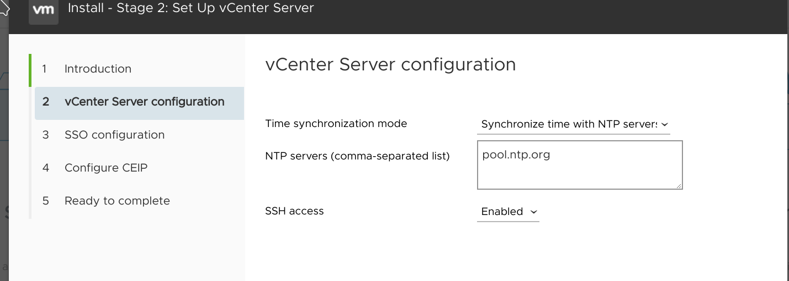

SSO Configuration


Ready for Install - summary of parameters

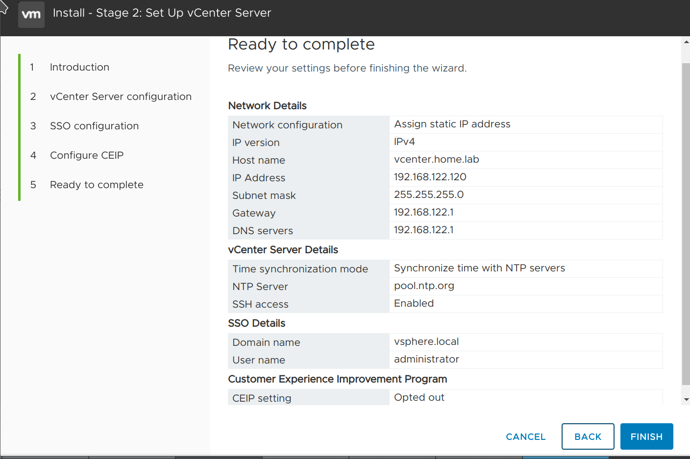

Stage 2 Complete  - Installed vCenter

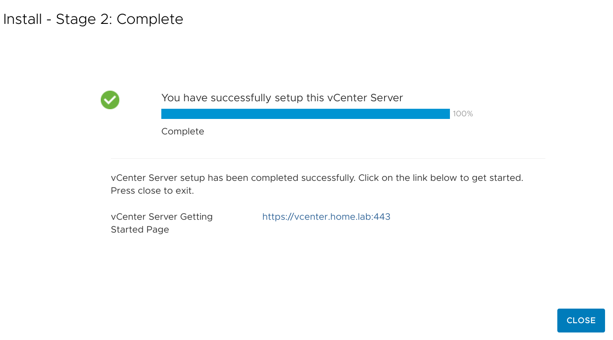

### Verify vCenter Installation

- Verified that vCenter VM was pingable from Hypervisor host.

- Connected with

  - vCenter Server Management  : https://vcenter.home.lab:5480/#/ui/summary

    

    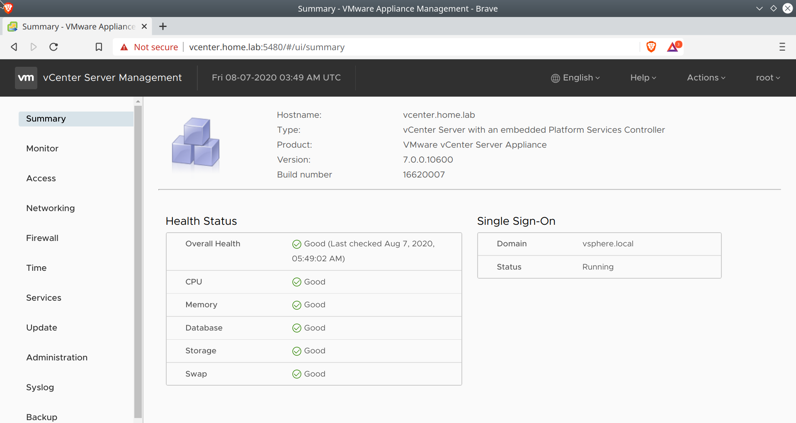

vSphere client:   https://vcenter.home.lab/ui/app/home

- Created a datacenter and cluster and assigned esxi12 host

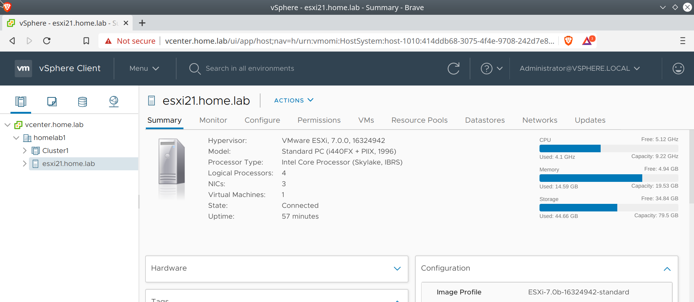

### Reconfigure esxi21 HW parameters 

- We used 20GB of RAM in the esxi21 VM since the vSphere 7.0 requires 19GB  RAM.
- To preserve RAM for other VMs,  we try to reduce the RAM, starting with 16GB. See screenshot of vSphere client for the resource consumption
- TODO - ongoing verification

## References

#### ESXi

- ESXi on KVM - Hypervisor : https://fabianlee.org/2018/09/19/kvm-deploying-a-nested-version-of-vmware-esxi-6-7-inside-kvm/

- ESXi on KVM - vCenter : https://fabianlee.org/2018/11/06/kvm-deploy-the-vmware-vcenter-appliance-using-the-cli-installer/

- https://rwmj.wordpress.com/2014/05/19/notes-on-getting-vmware-esxi-to-run-under-kvm/ 

- vSphere 7.0 and e1000 NIC in nested environments

  -  (VMware workstation): https://vinfrastructure.it/2020/04/installing-esxi-7-0-on-vmware-workstation/
  - Link that gave the idea to use "vmxnet3" as NIC type in KVM VM definition: https://forum.proxmox.com/threads/flapping-network-interface-in-kvm-box-for-proxmox-4-2.27836/

  

#### KVM - libvirt

- libvirt - networking : https://fabianlee.org/2018/11/06/kvm-deploy-the-vmware-vcenter-appliance-using-the-cli-installer/
